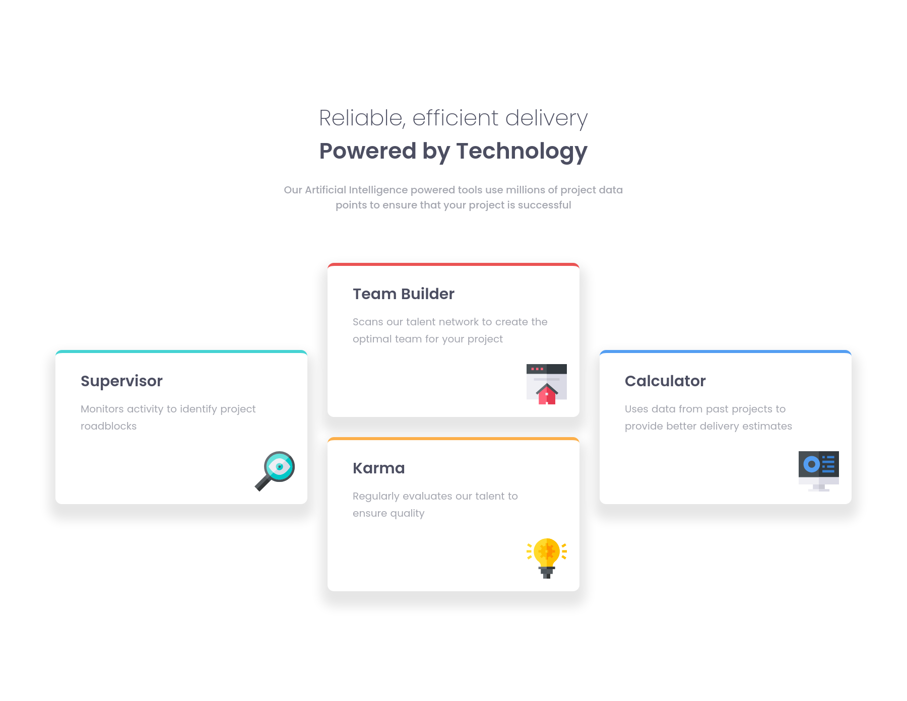
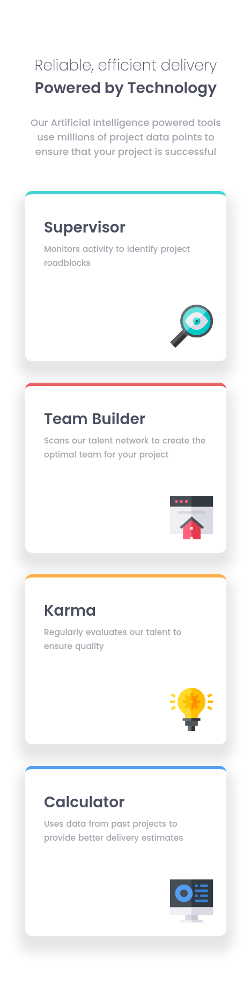

# Frontend Mentor - Four card feature section solution

This is a solution to the [Four card feature section challenge on Frontend Mentor](https://www.frontendmentor.io/challenges/four-card-feature-section-weK1eFYK). Frontend Mentor challenges help you improve your coding skills by building realistic projects. 

## Table of contents

- [Overview](#overview)
  - [The challenge](#the-challenge)
  - [Screenshot](#screenshot)
  - [Links](#links)
- [My process](#my-process)
  - [Built with](#built-with)
  - [What I learned](#what-i-learned)
  - [Continued development](#continued-development)
  - [Useful resources](#useful-resources)
- [Author](#author)

## Overview

### The challenge

Users should be able to:

- View the optimal layout for the site depending on their device's screen size

### Screenshot

<ins>Frontend Mentor's Desktop Solution</ins>


<ins>My desktop solution:</ins>



<ins>Frontend Mentor's Mobile Solution</ins>


<ins>My mobile solution:</ins>



### Links

- Solution URL: [Four Card Feature](https://four-card-feature-moonji.netlify.app/)

## My process

### Built with

- Semantic HTML5 markup
- CSS custom properties
- Flexbox
- CSS Grid
- Mobile-first workflow

### What I learned

To see how you can add code snippets, see below:

```html
<h1>Some HTML code I'm proud of</h1>
```
```css
.proud-of-this-css {
  color: papayawhip;
}
```

### Continued development

I want to refine and perfect mobile-first design where it's appropriate and most-effective to implement, and the same for responsive design as a whole. Hopefully after the 21-day course by Kevin Powell I will feel much more confident and can make more beautiful and functional pages! :) <3

### Useful resources

- [Web.dev Responsive Macro Layouts](https://web.dev/learn/design/macro-layouts?continue=https%3A%2F%2Fweb.dev%2Flearn%2Fdesign%23article-https%3A%2F%2Fweb.dev%2Flearn%2Fdesign%2Fmacro-layouts) - I referred back to this when designing my desktop and mobile responsiveness! Great for learning how to design a page layout. 

- [Web.dev Responsive Micro Layours](https://web.dev/learn/design/micro-layouts?continue=https%3A%2F%2Fweb.dev%2Flearn%2Fdesign%23article-https%3A%2F%2Fweb.dev%2Flearn%2Fdesign%2Fmicro-layouts) - This is great for building flexible components that can be placed anywhere! 

- [Kevin Powell's 21-Day Free Responsive CSS Course](https://www.example.com) - I am still working through this course because it is literally spanning 21 days lol, but I know Kevin is such a wonderful teacher with awesome advice and exercises!

- [Colt Steele's Free CSS Grid Course](https://www.coltsteele.com/tutorials/mastering-css-grid/css-grid-basics/enabling-css-grid) - This is an amazing free course by Colt Steele I took before starting my journey with Frontend Mentor. I recommend this brief course to everyone looking to better understand how CSS Grid works and how they can implement it practically!  

## Author

- Frontend Mentor - [@moonji-spoonji](https://www.frontendmentor.io/profile/moonji-spoonji)
